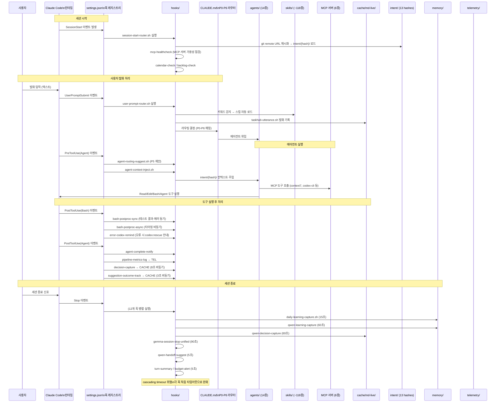
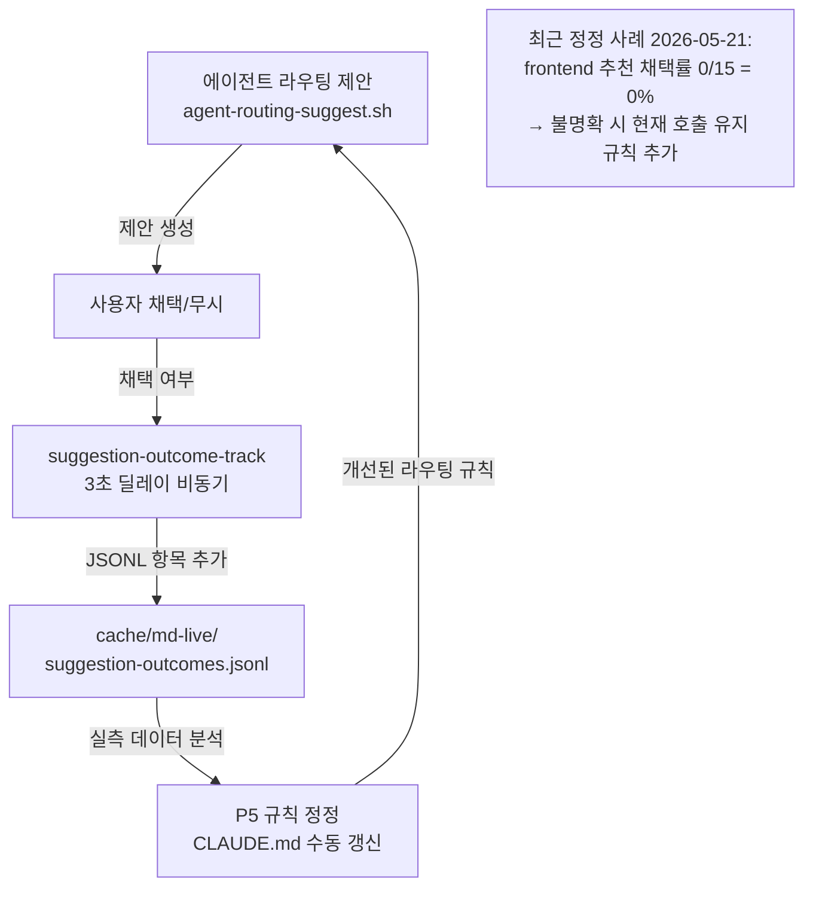

# 데이터 흐름, 영속성, 상태 관리

> 이 문서는 하네스 내부의 데이터 흐름 경로와 영속 데이터 저장 메커니즘을 서술한다.
> 모듈 경계는 [modules.md](./modules.md), 진입점은 [entry-points.md](./entry-points.md) 참조.
> [structure.md](../structure.md)의 시퀀스 다이어그램을 보완하는 심층 분석이다.

---

## 세션 라이프사이클 데이터 흐름



---

## 입력 → 라우팅 → 위임 → 도구 → 저장 흐름

각 처리 단계에서 데이터가 어떤 형태로 변환되는지 서술한다.

### 단계 1: 사용자 발화 입력

- **데이터 형태**: 평문 텍스트 (사용자가 입력한 한국어 또는 영어 문장)
- **처리 주체**: Claude Code 런타임
- **다음 단계**: `UserPromptSubmit` 이벤트 발생 → `settings.json` 훅 레지스트리로 전달

### 단계 2: UserPromptSubmit 훅 처리

- **데이터 형태**: JSON (이벤트 타입, 발화 텍스트, 세션 메타데이터) — stdin으로 전달
- **처리 주체**: `user-prompt-router.sh`, `taskhub-utterance.sh`
- **출력**: 스킬 키워드 감지 결과 → 스킬 자동 로드 신호 / 발화 기록 파일
- **다음 단계**: CLAUDE.md P0-P6 라우팅 결정

### 단계 3: P0-P6 라우팅 결정

- **데이터 형태**: 발화 텍스트 + 매칭된 시그널 (에이전트 명시 호출, 한글 에이전트명, 도메인 키워드)
- **처리 주체**: Claude Code + CLAUDE.md 규칙 (인컨텍스트 추론)
- **출력**: 위임할 에이전트 결정 + 적용할 단축 옵션 (P3)
- **다음 단계**: 에이전트 스폰

### 단계 4: 에이전트 스폰 및 컨텍스트 주입

- **데이터 형태**: 에이전트 프롬프트 텍스트 (에이전트 정의 + 컨텍스트 주입)
- **처리 주체**: `PreToolUse(Agent)` 훅 — `agent-context-inject.sh`
- **컨텍스트 주입 원천**:
  - `intent/{hash}/` 프로젝트별 의도
  - `memory/MEMORY.md` 글로벌 기억 인덱스
  - `workflows/` 조건부 로드 문서
  - `.moai/brand/` 브랜드 컨텍스트 (해당 시)
- **다음 단계**: 에이전트 도구 실행

### 단계 5: 도구 실행

- **데이터 형태**: 도구별 상이
  - `Read` — 파일 경로 + 읽기 옵션 → 파일 텍스트
  - `Edit` — 파일 경로 + old_string + new_string → 파일 변경
  - `Bash` — 명령어 문자열 → stdout/stderr 텍스트
  - `Agent` — 서브에이전트 프롬프트 → 서브에이전트 실행
- **처리 주체**: Claude Code 도구 런타임
- **보안 훅 개입**: `PreToolUse(Edit|Write)` — gemini-prescan-enforcer, dependency-change-detect
- **다음 단계**: `PostToolUse` 이벤트

### 단계 6: PostToolUse 처리 및 저장

- **데이터 형태**: JSON (이벤트 타입, 도구 이름, 입출력, 실행 결과) — stdin으로 전달
- **처리 주체**: 이벤트별 훅 핸들러
- **저장 대상**:
  - `telemetry/` — 타이밍 메트릭 (JSON lines)
  - `cache/md-live/suggestion-outcomes.jsonl` — 라우팅 채택 여부
  - `cache/md-live/` — decision 이벤트 파일

---

## 영속 데이터 저장 흐름

### `intent/{hash}/` 갱신 흐름

```
SessionStart 이벤트
  → session-start-router.sh
  → git remote URL 추출 → SHA256 해시 계산
  → intent/{hash}/ 디렉토리 존재 확인
  → 존재 시: 파일 목록 로드 → 에이전트 컨텍스트 주입
  → Stop 이벤트 시: 세션 종료 후 갱신된 의도 파일 저장
```

13개 프로젝트 해시 디렉토리 각각이 독립적인 프로젝트 컨텍스트를 보관한다.

### `memory/MEMORY.md` 인덱스 갱신 흐름

```
에이전트 명시적 기억 저장 요청
  → 에이전트가 Write/Edit 도구로 memory/{name}.md 생성
  → memory/MEMORY.md에 포인터 항목 추가 (1줄 요약)

Stop 이벤트 → qwen-learning-capture (60초)
  → 세션 학습 내용 Qwen 모델로 추출
  → 관련 memory/{agent}.md 파일 업데이트
  → MEMORY.md 인덱스 동기화
```

`MEMORY.md`는 최대 200줄 제한이 있으며, 항상 세션 컨텍스트에 로드된다.

### `cache/md-live/*.jsonl` 추가 흐름

```
PostToolUse(Agent) 이벤트 발생
  → suggestion-outcome-track 훅 (3초 딜레이 비동기)
    → 에이전트 라우팅 제안 채택 여부 감지
    → cache/md-live/suggestion-outcomes.jsonl에 JSON 항목 추가
  → decision-capture 훅 (8초 딜레이 비동기)
    → 의사결정 이벤트 추출
    → cache/md-live/{날짜}-decisions.jsonl에 JSON 항목 추가

Stop 이벤트 발생
  → qwen-decision-capture (60초)
    → 세션 전체 결정 이력 Qwen으로 정리
    → cache/md-live/에 결정 마크다운 저장
```

비동기 처리(3초, 8초 딜레이)는 에이전트 응답 속도에 영향을 주지 않기 위한 설계.

### `transcripts/{session_id}.jsonl` 누적 흐름

```
Claude Code 런타임 자동 처리
  → 매 대화 턴 transcripts/ 디렉토리에 누적
  → 세션 ID 기반 파일명 ({session_id}.jsonl)
  → 형식: JSON Lines (각 줄이 하나의 대화 턴)
```

전사 파일은 컨텍스트 재구성 및 회고(`/retro`) 스킬의 원천 데이터로 활용된다.

---

## 학습 피드백 루프

이 하네스의 핵심 자기 교정 메커니즘이다.



**피드백 루프 주기**: 실측 데이터가 충분히 누적되면 CLAUDE.md P5 규칙을 수동으로 정정한다. 완전 자동화는 아니며, 사용자(joo.leonard@gmail.com)가 데이터를 해석하고 규칙을 업데이트한다.

---

## 의사결정 캡처 흐름

```
에이전트가 의사결정을 수행
  → PostToolUse(Agent) 이벤트
  → decision-capture 훅 (8초 딜레이 비동기)
    → 결정 유형 분류 (architecture / testing / workflow / security 등)
    → cache/md-live/에 결정 항목 저장

Stop 이벤트
  → qwen-decision-capture (60초)
    → 세션 전체 결정 이력 종합
    → cache/md-live/에 결정 마크다운 저장

사용자가 /retro 호출
  → retro 스킬 실행
  → cache/md-live/ 파일 조회
  → 결정 패턴 분석 및 성장 인사이트 생성
  → growth.md 또는 사용자에게 직접 보고

사용자가 /decisions [검색어] 호출
  → decisions 스킬 실행
  → cache/md-live/ 결정 파일 검색
  → 관련 결정 이력 반환
```

`decisions/` 디렉토리는 존재하지 않는다. 결정 캡처 산출물은 모두 `cache/md-live/`에 저장된다.

---

## 실패 복구 흐름

```
에이전트가 Bash 도구 실행 → 오류 발생
  → PostToolUse(Bash) 이벤트 (오류 코드 포함)
  → error-codex-remind 훅 실행
    → 오류 횟수 카운팅
    → 1-2회: 에러 메시지 기록, 다음 시도 안내
    → 3회 연속 실패: codex:rescue 트리거 안내 메시지 출력
    → 사용자가 codex:rescue 스킬 호출 또는 자동 위임

codex:rescue 실행
  → codex-cli MCP 서버 통해 Codex에 구조 요청
  → Codex가 코드 분석 + 수정 제안 반환
  → 에이전트가 제안 채택 여부 결정
  → 성공 시: 작업 재개
  → 실패 시: 사용자에게 에스컬레이션
```

디버깅 단계별 절차는 `workflows/debugging.md`에 정의되어 있다 (7단계: 재현→수집→범위축소→가설→검증→수정→확인).

---

## 데이터 무결성 보장

### 12개 병렬 Stop 훅의 Cascading Timeout 대처

Stop 이벤트에 12개 훅이 병렬로 실행된다. 각 훅이 독립된 타임아웃으로 실행되어 한 훅의 실패가 다른 훅을 차단하지 않는다.

```
Stop 이벤트 발생
  ├── gemma-session-stop-unified (90초 독립 타임아웃)
  ├── qwen-learning-capture (60초 독립 타임아웃)
  ├── qwen-decision-capture (60초 독립 타임아웃)
  ├── qwen-handoff-suggest (5초 독립 타임아웃)
  ├── daily-learning-capture.sh (15초 독립 타임아웃)
  ├── turn-summary (5초 독립 타임아웃)
  ├── budget-alert (5초 독립 타임아웃)
  └── (기타 5개 훅) (각자 독립 타임아웃)

→ 타임아웃 초과 훅: 해당 캡처만 누락 (다른 훅은 계속 실행)
→ 네트워크 지연 (ollama 서버 등): 60-90초 훅이 실패 가능
→ 최근 audit (c267d50): 일부 노이즈 훅 제거로 병렬 부하 완화
```

**알려진 리스크**: 세션 종료 시 ollama 서버 지연으로 qwen-learning-capture, qwen-decision-capture가 누락될 수 있다. 이 경우 해당 세션의 학습 캡처가 불완전해진다.

### 비동기 훅의 데이터 일관성

`decision-capture`(8초)와 `suggestion-outcome-track`(3초)은 비동기로 실행된다. 에이전트 응답과 분리되어 실행되므로, 드물지만 에이전트 응답 직후 세션이 종료되면 해당 이벤트가 캡처되지 않을 수 있다.

### RAG 임베딩 일관성

`local-rag` MCP 서버의 RAG 임베딩은 코드 변경 후 자동 재색인되지 않는다. 코드 변경이 있은 후 RAG 검색 결과가 stale 상태일 수 있다. 수동으로 `scripts/run-local-rag.sh`를 재실행하여 임베딩을 갱신해야 한다.

---

## 상태 저장소 전체 지도

| 저장소 | 경로 | 데이터 형태 | 갱신 트리거 | 보존 정책 |
|--------|------|-----------|-----------|---------|
| 프로젝트 의도 | `intent/{hash}/` | 마크다운, JSON | SessionStart / Stop 훅 | 프로젝트 존속 기간 |
| 글로벌 기억 인덱스 | `memory/MEMORY.md` | 마크다운 (최대 200줄) | 에이전트 Write / qwen-learning-capture | 누적 (아카이브 분리) |
| 도메인 교훈 | `memory/lessons.md` | 마크다운 (최대 50건) | Stop 훅 / 에이전트 Write | 누적 (초과 시 archive) |
| 라우팅 실측 | `cache/md-live/suggestion-outcomes.jsonl` | JSON Lines | suggestion-outcome-track (비동기) | 누적 (정리 ad-hoc) |
| 훅 실행 결과 | `cache/md-live/hook-outcomes.jsonl` | JSON Lines | 훅 실행 시 | 누적 (정리 ad-hoc) |
| 결정 이력 | `cache/md-live/*.jsonl, *.md` | JSON Lines / 마크다운 | decision-capture / qwen-decision-capture | 누적 (/retro, /decisions 조회) |
| RAG 임베딩 | `cache/` (주 용량 795MB) | 벡터 인덱스 | 수동 재색인 | ad-hoc 정리 |
| 파이프라인 메트릭 | `telemetry/` | JSON Lines | pipeline-metrics-log (PostToolUse) | 누적 |
| 세션 전사 | `transcripts/` | JSON Lines | Claude Code 자동 | 누적 |
| 설정 스냅샷 | `backups/` | JSON (settings.json 사본) | 설정 변경 전 | 수동 정리 |
| 에이전트 행동 모델 | `self-model/` (53개 디렉토리) | 마크다운, JSON | Stop 훅 / PostToolUse 훅 | 누적 |
| 파일 변경 이력 | `file-history/` | 텍스트 | 파일 수정 시 자동 | 자동 누적 |
| 세션 환경 스냅샷 | `session-env/` | 텍스트 | SessionStart / Stop | 세션 종료 후 정리 |
| MoAI SPEC | `.moai/specs/SPEC-XXX/` | 마크다운 | /moai plan 실행 | SPEC 존속 기간 |
| MoAI 체크포인트 | `.moai/state/checkpoints/` | JSON | 에이전트 체크포인트 | 작업 완료 후 정리 |
| 활성 계획 | `plans/` | 마크다운 | 계획 생성/완료 | 완료 시 삭제 또는 보존 |

---

*아키텍처 개요: [overview.md](./overview.md)*
*모듈 인터페이스: [modules.md](./modules.md)*
*의존성 그래프: [dependencies.md](./dependencies.md)*
*진입점: [entry-points.md](./entry-points.md)*

Last updated: 2026-05-25
