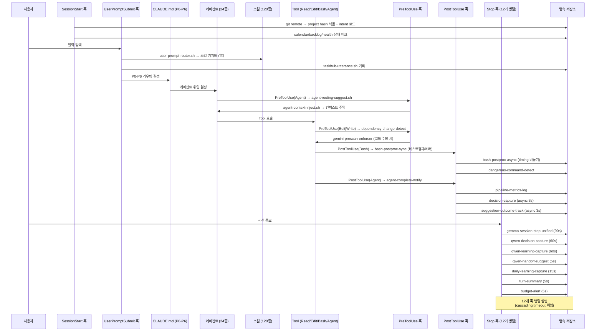

# 디렉토리 구조 및 모듈 경계

## 최상위 레이아웃

| 디렉토리 / 파일 | 역할 | 비고 |
|----------------|------|------|
| `agents/` | 14개 특화 에이전트 정의 (`*.md`, YAML frontmatter + 프롬프트 본문) | `agents-src/` 13개 원본을 `build-agents.sh`로 빌드 |
| `agents-src/` | 13개 에이전트 소스 원본 | 정본. 압축 시 nuance loss 가능 |
| `skills/` | 70개 사용자 정의 스킬 디렉토리 | `.claude/.claude/skills/`와 이중 경로 |
| `.claude/skills/` (즉 `~/.claude/.claude/skills/`) | 48개 MoAI 프레임워크 스킬 | 글로벌 스킬 레지스트리 |
| `hooks/` | 87개 최상위 훅 (`*.sh`, `*.py`) + `_archive/`, `_disabled/`, `_lib/` | settings.json 이벤트별 등록 |
| `commands/` | 14개 슬래시 명령 정의 (`*.md`) | 얇은 라우터 패턴 |
| `workflows/` | 16개 조건부 로드 워크플로우 문서 | 키워드 트리거 시 CLAUDE.md에서 참조 |
| `.claude/rules/` (즉 `~/.claude/.claude/rules/`) | 34개 헌법적 규칙 파일 (moai/design, moai/core, moai/development, moai/workflow) | FROZEN 존 포함 |
| `scripts/` | 82개 유틸리티 스크립트 (`*.sh`, `*.py`) | run-local-rag.sh, failure-forecaster.py 등 |
| `CLAUDE.md` | 글로벌 설정 (핵심 원칙, P0-P6 라우팅 테이블, 도구 분담) | 모든 세션의 최상위 컨텍스트 |
| `settings.json` | 훅 이벤트 등록, MCP 서버, 권한 정책 | 이벤트 버스 설정 파일 |
| `.mcp.json` | MCP 서버 3종 (context7, sequential-thinking, moai-lsp) | 프로젝트 범위 MCP |
| `.moai/` | MoAI 프레임워크 통합 설정 및 상태 | manifest.json 2958줄, 28 YAML 섹션 |
| `plans/` | 활성/완료 계획 파일 | 세션 간 태스크 연속성 |
| `intent/` | 13개 프로젝트 해시별 의도 디렉토리 | git remote 기반 프로젝트 식별 |
| `memory/` | 2개 글로벌 기억 파일 (MEMORY.md, lessons.md) | 에이전트별 메모리 + 교훈 |
| `cache/` | 1291+ 캐시 항목 / 약 795MB | md-live/(라우팅 룰·결정·suggestion-outcomes·hook-outcomes), RAG 임베딩, 세션 스냅샷 |
| `telemetry/` | 파이프라인 메트릭 로그 | 에이전트 실행 추적 |
| `transcripts/` | 세션 전사 기록 | 컨텍스트 재구성용 |
| `backups/` | 자동 백업 | 설정 변경 전 스냅샷 (settings.json.bak-{date}) |
| `self-model/` | 에이전트 행동 모델 (53개 디렉토리) | per-agent interaction patterns, decision traces |
| `plugins/` | 4개 최상위 (`marketplaces/`, `cache/`, `data/`, `repos/`) — 약 6107 파일 / 133MB | claude-mem, codex, superpowers, gitkraken 등 활성 8 플러그인 |

## 모듈 경계

### `.claude/agents/` — 에이전트 정의 모듈
- **책임**: 특화 에이전트 24개의 역할·권한·시스템 프롬프트 정의
- **입력**: CLAUDE.md의 P0-P6 라우팅 결정에 따라 호출됨
- **출력**: 에이전트 실행 결과를 PostToolUse(Agent) 훅으로 전달
- **빌드 경로**: `agents-src/{lang}/` → `build-agents.sh` → `agents/builds/{lang}/`
- **주의**: agents-src에서 builds로 압축 시 프롬프트 뉘앙스 손실 위험 존재

### `.claude/skills/` + `.claude/.claude/skills/` — 스킬 자동 로드 모듈
- **책임**: 컨텍스트별 능력 집합 제공 (YAML frontmatter 트리거 기반 자동 로드)
- **입력**: UserPromptSubmit 훅 → user-prompt-router.sh가 스킬 키워드 감지
- **출력**: 스킬 본문이 에이전트 컨텍스트에 주입됨
- **이중 경로**: `.claude/skills/`(사용자 정의 71개) vs `.claude/.claude/skills/`(MoAI 프레임워크 49개) 네임스페이스 충돌 가능 — 알려진 리스크

### `.claude/hooks/` — 이벤트 훅 모듈
- **책임**: 이벤트별 자동화 실행 (검증·알림·메트릭·학습 캡처)
- **입력**: settings.json 훅 레지스트리에서 이벤트 수신
- **출력**: 실행 결과를 cache/md-live/, telemetry/, memory/ 에 기록
- **병렬 실행**: Stop 이벤트 시 최대 12개 훅 동시 실행 — cascading timeout 위험

### `.claude/commands/` — 슬래시 명령 모듈
- **책임**: 얇은 라우팅 래퍼 (20줄 이하). 로직 없이 스킬/에이전트로 위임
- **입력**: 사용자의 `/명령` 직접 입력
- **출력**: Skill() 호출 또는 에이전트 위임

### `.claude/workflows/` — 워크플로우 조건부 로드 모듈
- **책임**: 도메인별 상세 절차 문서 16개 보관
- **입력**: CLAUDE.md의 키워드 트리거 테이블에서 조건부 Read 호출
- **출력**: 에이전트 컨텍스트에 워크플로우 지침 주입

### `.claude/rules/` — 헌법적 규칙 모듈
- **책임**: FROZEN 구역 규칙 보관 (design/constitution.md, moai-constitution.md 등)
- **입력**: 세션 시작 시 자동 로드 (project instructions)
- **출력**: 모든 에이전트의 행동 제약 조건

### `intent/` — 프로젝트 컨텍스트 저장소
- **책임**: git remote 기반 프로젝트 식별(13개 해시) 및 세션 간 의도 유지
- **입력**: SessionStart 훅 → session-start-router.sh
- **출력**: 에이전트 컨텍스트에 프로젝트별 의도 주입

### `memory/` — 글로벌 기억 저장소
- **책임**: 에이전트별 장기 메모리(MEMORY.md) + 도메인 교훈(lessons.md)
- **입력**: Stop 훅 → daily-learning-capture.sh, qwen-learning-capture
- **출력**: 다음 세션의 에이전트 컨텍스트 보강

### `cache/` — 캐시 저장소
- **책임**: RAG 임베딩, 실측 데이터(suggestion-outcomes.jsonl, hook-outcomes.jsonl), 세션 스냅샷
- **입력**: PostToolUse 훅, Stop 훅 비동기 기록
- **출력**: P5 라우팅 자기 교정, 성능 메트릭 분석

### `.moai/` — MoAI 프레임워크 통합 레이어
- **책임**: manifest.json(템플릿 레지스트리), 28개 YAML 설정 섹션, 브랜드/디자인/스펙/상태 관리
- **입력**: /moai 명령군, moai-* 스킬
- **출력**: 에이전트 스폰 컨텍스트, 품질 게이트 기준

## 모듈 간 신호 인터페이스

아래는 한 번의 사용자 발화에서 Stop까지 이어지는 전체 이벤트 흐름이다.



### 신호 인터페이스 요약표

| 소스 모듈 | 이벤트 | 수신 모듈 | 전달 내용 |
|----------|--------|----------|----------|
| settings.json | SessionStart | hooks/ | session-start-router 실행 |
| hooks/ (session-start) | 프로젝트 식별 | intent/ | project hash 기반 컨텍스트 로드 |
| settings.json | UserPromptSubmit | hooks/ | user-prompt-router 실행 |
| hooks/ (prompt-router) | 스킬 감지 | skills/ | 키워드 매칭 스킬 자동 로드 |
| CLAUDE.md (P0-P6) | 라우팅 결정 | agents/ | 에이전트 위임 |
| settings.json | PreToolUse(Agent) | hooks/ | agent-routing-suggest, context-inject |
| settings.json | PreToolUse(Edit|Write) | hooks/ | dependency-change-detect, prescan-enforcer |
| settings.json | PostToolUse(Bash) | hooks/ | bash-postproc (sync+async), error-codex-remind |
| settings.json | PostToolUse(Agent) | hooks/ | agent-complete-notify, metrics-log, decision-capture |
| settings.json | Stop | hooks/ (12개 병렬) | 학습/결정/핸드오프/예산 캡처 |
| hooks/ (Stop) | 학습 캡처 | memory/ | MEMORY.md, lessons.md 업데이트 |
| hooks/ (PostToolUse) | 메트릭 기록 | cache/md-live/ | suggestion-outcomes, hook-outcomes |
| hooks/ (PostToolUse) | 메트릭 기록 | telemetry/ | 파이프라인 타이밍 |

## .moai/ 통합 레이아웃

```
.moai/
├── manifest.json          # 2958줄 SHA256 템플릿 레지스트리
├── config/
│   └── sections/          # 28개 YAML 설정 섹션 (design.yaml 포함)
├── project/
│   ├── brand/             # 브랜드 컨텍스트 (헌법적 제약)
│   ├── interview.md       # 프로젝트 인터뷰 (Phase 1 원천)
│   ├── product.md         # 제품 정의 (이 문서 포함)
│   ├── structure.md       # 구조 문서 (이 문서)
│   └── tech.md            # 기술 스택 문서
├── db/                    # 데이터베이스 스키마/마이그레이션 관련
├── design/                # 디자인 반복 산출물
├── evolution-log.md       # 진화 이력 (evolvable 구역 변경 기록)
├── learning/              # 학습 관찰 항목
├── logs/                  # MoAI 실행 로그
├── specs/                 # SPEC-XXX/ 스펙 문서
├── sprints/               # Sprint Contract 산출물
└── state/
    └── checkpoints/       # 에이전트 체크포인트
```

## 상태 저장소

| 저장소 | 항목 수 / 크기 | 보존 정책 |
|--------|--------------|----------|
| `cache/` | 1291+ 항목 / 795MB | ad-hoc 정리 (알려진 리스크) |
| `intent/` | 13개 프로젝트 해시 | 프로젝트 존속 기간 |
| `memory/` | 2개 파일 | 누적 (아카이브 정책 50건 제한) |
| `plans/` | 활성/완료 계획 | 완료 시 삭제 또는 보존 |
| `backups/` | 설정 스냅샷 | 수동 정리 |
| `file-history/` | 파일 변경 이력 | 자동 축적 |
| `paste-cache/` | 클립보드 캐시 | 세션 범위 |
| `session-env/` | 세션 환경 변수 스냅샷 | 세션 종료 후 정리 |
| `shell-snapshots/` | 셸 상태 스냅샷 | 세션 범위 |
| `telemetry/` | 파이프라인 메트릭 | 누적 |
| `transcripts/` | 세션 전사 | 누적 |
| `decisions/` | 결정 이력 | 누적 |

## 빌드 메커니즘

에이전트는 두 단계로 관리된다:

```
agents-src/
├── {lang}/          # 언어별 소스 원본
│   └── *.md         # 에이전트 정의 원본
└── build-agents.sh  # 빌드 스크립트

→ agents/
   └── builds/
       └── {lang}/   # 압축된 에이전트 정의
```

`package.sh`와 `setup.sh`는 전체 하네스 초기화 및 패키징을 담당한다.

**주의**: agents-src → builds 압축 과정에서 프롬프트 뉘앙스 손실이 발생할 수 있다. 원본(agents-src)이 항상 정본이다.

## 알려진 구조적 리스크

| 리스크 | 위치 | 영향 | 현황 |
|--------|------|------|------|
| **Dual skills path** | `.claude/skills/` vs `.claude/.claude/skills/` | 네임스페이스 충돌, 로드 우선순위 불명확 | 미해결 |
| **Plugin 파일 누적** | `plugins/` (6107 파일 / 133MB) | 디스크 사용량, 정리 정책 ad-hoc | 미해결 |
| **12개 병렬 Stop 훅** | settings.json Stop 이벤트 | Cascading timeout 위험 | 최근 audit으로 일부 완화 (c267d50) |
| **cache 누적** | `cache/` (795MB) | Stale RAG 임베딩 가능 | 정리 정책 ad-hoc |
| **agents-src 압축 손실** | `agents-src/ → builds/` | 프롬프트 뉘앙스 손실 가능 | 원본 보존으로 완화 |
| **CI 부재** | 전체 | 회귀 감지 자동화 없음 | 의도적 선택. hook 기반 self-validation으로 대체 |
| **P5 라이브 튜닝** | CLAUDE.md P5 규칙 | 실측 데이터 기반 지속 변경 — 안정성 vs 정확성 균형 | 진행 중 (2026-05-21 정정 완료) |

---

Last updated: 2026-05-25
