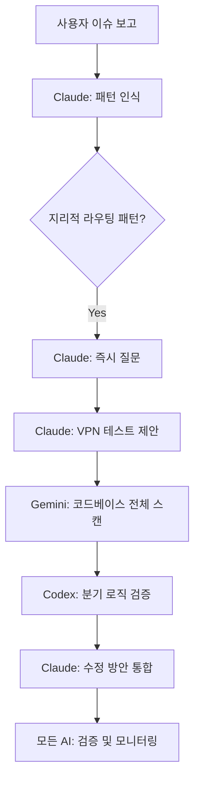

# AI 통합 디버깅 가이드 시스템

> **목적**: Claude, Gemini, Codex 모든 AI가 활용할 수 있는 체계적 디버깅 가이드
> **기반 사례**: 2026-04-14 STT 외계어 이슈 (13시간 → 1시간으로 단축 목표)

## 📁 파일 구조

```
~/.claude/debugging-guides/
├── README.md                           # 이 파일 (통합 인덱스)
├── geo-routing-debug-pattern.yml       # 마스터 패턴 정의 (모든 AI 공통)
├── claude-geo-routing-guide.md         # Claude 전용 (대화형, 스킬 연계)
├── gemini-geo-routing-analysis.md      # Gemini 전용 (대규모 분석)
├── codex-geo-routing-debug.md          # Codex 전용 (코드 검증, 테스트)
├── geo-routing-commands-reference.md   # 명령어 레퍼런스 (실행 가능한 모든 명령어)
└── stt-garbled-text-response-guide.md  # 원본 STT 이슈 가이드

실행 스크립트:
~/Workspace/scripts/geo-debug.sh        # 종합 진단 스크립트
~/Workspace/scripts/country-test.sh     # 국가별 테스트 스크립트
~/Workspace/debugging-cheatsheet.md     # 빠른 참조 치트시트
```

## 🎯 각 AI별 역할 분담

### Claude 🤖
- **역할**: 대화 주도, 패턴 인식, 전체 오케스트레이션
- **가이드**: `claude-geo-routing-guide.md`
- **특화**: 즉시 질문, VPN 테스트 제안, 스킬 연계
- **사용법**: 패턴 감지 시 자동 적용

### Gemini 🧠
- **역할**: 대규모 코드베이스 분석, 패턴 매칭
- **가이드**: `gemini-geo-routing-analysis.md`
- **특화**: 전체 스캔, 설정 충돌 검증, 의존성 체인 분석
- **사용법**: `ask-gemini` 스킬로 가이드 내용 포함하여 분석 요청

### Codex ⚡
- **역할**: 코드 검증, 테스트 케이스, 수정안 제시
- **가이드**: `codex-geo-routing-debug.md`
- **특화**: 실행 가능한 테스트, 구체적 수정 코드
- **사용법**: `ask-codex` 스킬로 가이드 기반 코드 리뷰 요청

## 🔄 AI 간 협업 플로우



## 🚀 사용 방법

### Claude 사용자 (기본)
```
사용자가 "일부 사용자만 영향" 언급 시:
→ Claude가 자동으로 geo-routing 패턴 적용
→ 즉시 해외 사용자 여부 질문
→ 필요시 Gemini/Codex에 위임
```

### Gemini 활용 (대규모 분석)
```bash
# ask-gemini 스킬 사용 시
@gemini "지리적 라우팅 디버깅 가이드를 참고해서 코드베이스 전체를 스캔하여
country, KR, DEFAULT 패턴의 분기 로직을 모두 찾고 분석해줘"
```

### Codex 활용 (코드 검증)
```bash
# ask-codex 스킬 사용 시
@codex "지리적 라우팅 디버깅 가이드의 테스트 케이스를 참고해서
Lambda@Edge 분기 로직을 검증하고 수정안을 제시해줘"
```

## 📊 성과 측정

### Before (기존 방식)
- **시간**: 13시간 삽질
- **접근**: 코드 분석 우선
- **도구**: 단일 AI 사용
- **결과**: 늦은 문제 해결

### After (가이드 적용)
- **시간**: 1시간 내 해결 목표
- **접근**: 패턴 인식 우선
- **도구**: 다중 AI 협업
- **결과**: 빠른 문제 해결

## 🔧 가이드 업데이트

### 새로운 패턴 추가 시:
1. `[pattern-name]-debug-pattern.yml` 생성 (마스터)
2. `claude-[pattern-name]-guide.md` 생성 (Claude용)
3. `gemini-[pattern-name]-analysis.md` 생성 (Gemini용)
4. `codex-[pattern-name]-debug.md` 생성 (Codex용)
5. 이 README.md 업데이트

### 기존 가이드 개선 시:
- 실제 사례 기반으로 업데이트
- AI별 특화 내용 보강
- 성과 측정 결과 반영

## ⚠️ 중요 사항

### AI 간 문서 공유 방법
- **Claude**: 직접 읽기 가능
- **Gemini**: `ask-gemini` 스킬로 가이드 내용 포함하여 요청
- **Codex**: `ask-codex` 스킬로 가이드 내용 포함하여 요청
- **수동**: 사용자가 가이드 내용을 복사해서 다른 AI에 전달

### 가이드 진화
이 가이드들은 실제 사례를 통해 지속적으로 개선됩니다:
- 새로운 버그 패턴 발견 시 추가
- 효과적이지 않은 접근법 제거
- AI별 특화 내용 보강

---

**목표**: 13시간 삽질을 1시간 해결로. 패턴 기반 협업으로 효율성 극대화.
